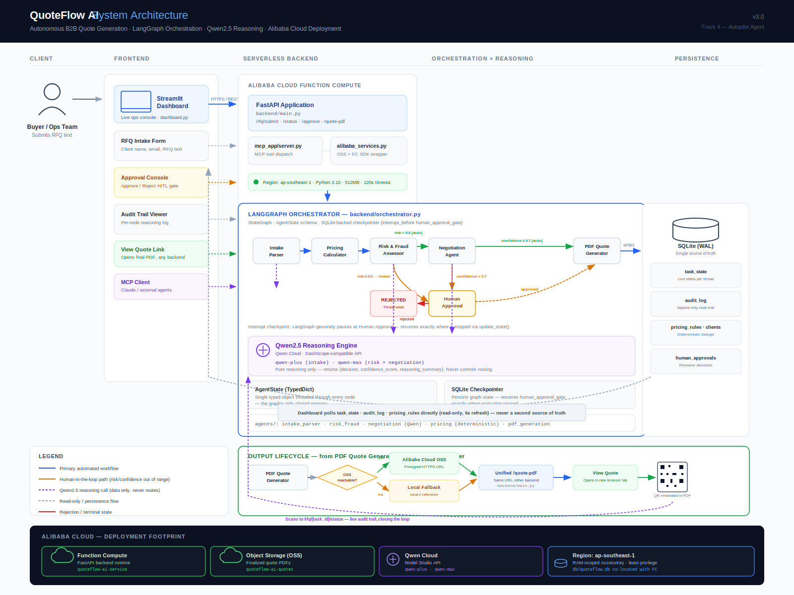
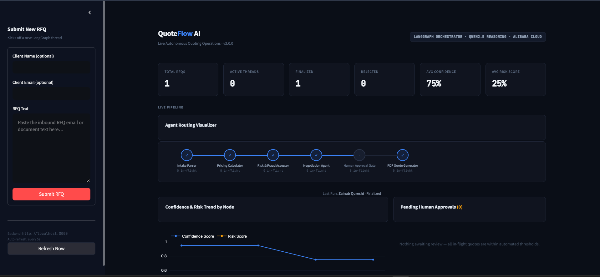
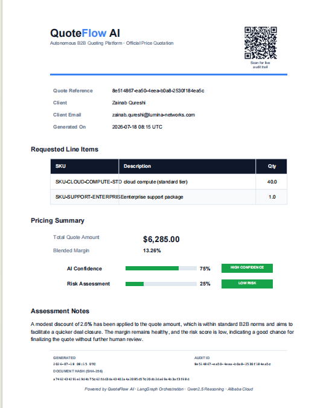
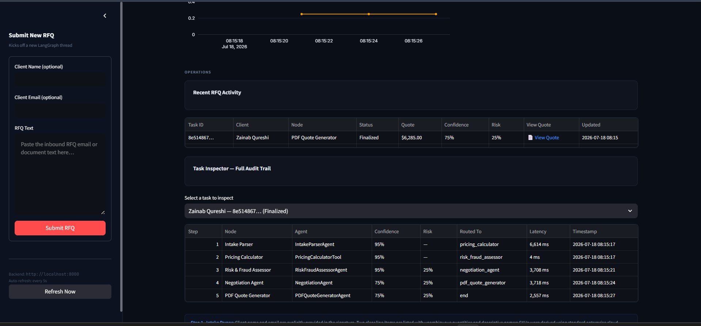
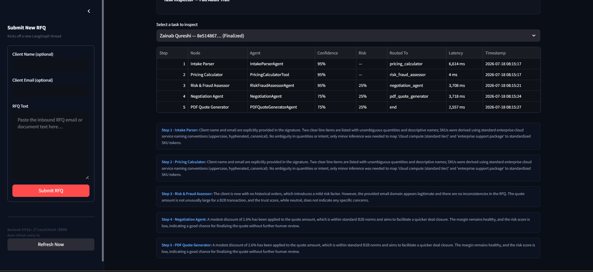

# QuoteFlow AI v3.0

**Autonomous B2B Quote Generation, Orchestrated End-to-End**

QuoteFlow AI takes a raw inbound RFQ (an email, a pasted document, anything a buyer sends) and carries it, unattended, through structured extraction, deterministic pricing, AI-driven risk assessment, negotiation, an optional human approval checkpoint, and a finished, branded PDF quote. Every score, every routing decision, and every reasoning trace is written to a live, auditable database as it happens.

Built for the **Global AI Hackathon Series with Qwen Cloud** — Track 4: Autopilot Agent.



<p align="center">
  
  
</p>
<p align="center">
  <sub>Left: the live Agent Routing Visualizer mid-pipeline, with real-time KPIs pulled from SQLite. Right: the branded, auto-generated quote PDF with a QR code linking to the live audit trail.</sub>
</p>

---

## Table of Contents

- [Why QuoteFlow AI](#why-quoteflow-ai)
- [How It Works](#how-it-works)
- [Tech Stack](#tech-stack)
- [Alibaba Cloud Integration](#alibaba-cloud-integration)
- [Project Structure](#project-structure)
- [Getting Started](#getting-started)
- [The Dashboard](#the-dashboard)
- [Human-in-the-Loop](#human-in-the-loop)
- [The Generated Quote PDF](#the-generated-quote-pdf)
- [Model Context Protocol (MCP) Server](#model-context-protocol-mcp-server)
- [Testing](#testing)
- [Configuration](#configuration)
- [License](#license)

---

## Why QuoteFlow AI

Sales operations teams routinely burn hours per RFQ — re-keying line items by hand, cross-checking pricing sheets, guessing at buyer risk, and chasing approvals across email threads. QuoteFlow AI automates that entire chain while keeping a human explicitly in control of anything risky or uncertain. Not blind automation — **accountable automation**, with a full audit trail behind every number the system produces.

---

## How It Works

Every RFQ runs through a compiled **LangGraph `StateGraph`**, checkpointed to SQLite so execution can genuinely pause and resume — not poll, *pause*:

```
                              ┌─────────────────────┐
   RFQ Text ──▶ Intake Parser │  Qwen: qwen-plus     │
                              └──────────┬───────────┘
                                         ▼
                              ┌─────────────────────┐
                              │  Pricing Calculator  │  ← deterministic SQL lookup, no LLM
                              └──────────┬───────────┘
                                         ▼
                              ┌─────────────────────┐
                              │ Risk & Fraud Assessor│  Qwen: qwen-max
                              └──────────┬───────────┘
                        risk < 0.6 ◄─────┴─────► risk ≥ 0.6
                              ▼                        ▼
                   ┌─────────────────────┐   ┌─────────────────────┐
                   │  Negotiation Agent   │   │  Human Approval Gate │◄─┐
                   │      Qwen: qwen-max  │   │   (interrupt_before)  │  │
                   └──────────┬───────────┘   └──────────┬───────────┘  │
              confidence ≥ 0.7 │                  approved │  rejected   │
                               │                           │            │
                     confidence < 0.7 ─────────────────────┘            │
                               │                                        │
                               ▼                                        │
                   ┌─────────────────────┐                              │
                   │  PDF Quote Generator │──────────────────────────────┘
                   └──────────┬───────────┘   (low-confidence / high-risk quotes
                              ▼                 route here before continuing)
                        Finished PDF ──▶ Alibaba OSS (or local fallback) ──▶ View Quote link

```

| Node | Role | Reasoning Engine |
|---|---|---|
| **Intake Parser** | Extracts client info + structured line items from raw text | Qwen `qwen-plus` |
| **Pricing Calculator** | Computes quote amount + blended margin from `pricing_rules` | Deterministic — no LLM |
| **Risk & Fraud Assessor** | Scores the transaction 0.0–1.0 against client history | Qwen `qwen-max` |
| **Negotiation Agent** | Proposes final pricing + a confidence score | Qwen `qwen-max` |
| **Human Approval Gate** | A genuine LangGraph `interrupt_before` checkpoint | — (human decision) |
| **PDF Quote Generator** | Renders the branded PDF, uploads it, returns a URL | Deterministic — no LLM |

**Strict separation of concerns**, enforced in the code itself: Qwen never decides what happens next — every reasoning call returns `{decision, confidence_score, reasoning_summary}` and nothing more. LangGraph's conditional edges are the *only* thing that reads those scores and routes the graph. This means the routing logic is fully deterministic, testable, and auditable independent of any LLM's behavior — see [`tests/test_orchestrator_routing.py`](./tests/test_orchestrator_routing.py).

---

## Tech Stack

| Layer | Technology |
|---|---|
| Orchestration | **LangGraph** (`StateGraph`, SQLite-backed checkpointer, `interrupt_before`) |
| Reasoning | **Qwen2.5** (`qwen-plus`, `qwen-max`) via **Qwen Cloud** / DashScope-compatible API |
| Backend API | **FastAPI** — serverless-ready |
| Database | **SQLite** (WAL mode) — single source of truth for state and audit |
| Dashboard | **Streamlit**, custom-styled, auto-refreshing (`streamlit-autorefresh`) |
| PDF Generation | **ReportLab** — branded layout, QR codes, visual score badges |
| Cloud Storage | **Alibaba Cloud OSS** (`oss2`) |
| Cloud Compute | **Alibaba Cloud Function Compute** (`aliyun-fc2`) |
| Agent Interop | **Model Context Protocol (MCP)** server exposing every pipeline action as a tool |
| Testing | **pytest** — pure unit tests, no network calls required |

---

## Alibaba Cloud Integration

This is the section judges verifying "Proof of Alibaba Cloud Deployment" should look at first: **[`alibaba_services.py`](./alibaba_services.py)**.

It is not a mock. Every method makes a real network call via the official SDKs:

- **`AlibabaOSSService`** (via `oss2`): checks whether the configured bucket exists, creates it if not, uploads files, generates presigned download URLs, and lists stored quote objects.
- **`AlibabaFunctionComputeService`** (via `aliyun-fc2`): checks whether the serverless function is deployed, fetches its live metadata, and can invoke it directly.

Run a live health check against both services with your own credentials:

```bash
python alibaba_services.py
```

```
============================================================
QuoteFlow AI v3.0 — Alibaba Cloud Deployment Health Check
============================================================
Region: ap-southeast-1
OSS Bucket: quoteflow-ai-quotes
FC Service/Function: quoteflow-ai-service/quoteflow-orchestrator
============================================================
1. Object Storage Service (OSS)
============================================================
✔ Bucket 'quoteflow-ai-quotes' exists and is reachable.
✔ Listed N object(s) under prefix 'quotes/'.
============================================================
2. Function Compute (FC)
============================================================
ℹ FC service is not deployed yet — expected during local development.
```

**How the finished PDF actually reaches Alibaba Cloud:** [`agents/pdf_generation_agent.py`](./agents/pdf_generation_agent.py) renders the quote, then attempts `_upload_to_oss(...)`. If it succeeds, `task_state.pdf_oss_url` stores a real presigned OSS URL. If OSS is temporarily unavailable or not configured., the module transparently falls back to a `local://` reference and the pipeline still completes rather than failing the whole task. [`backend/main.py`](./backend/main.py)'s `/api/v1/rfq/{task_id}/quote-pdf` endpoint serves either form identically, so the dashboard's **"View Quote"** link always works the same way regardless of which backend actually holds the file — nothing about this behavior is hardcoded to one path.

> **Transparency note: **QuoteFlow AI is designed with a resilient storage architecture that ensures uninterrupted workflow execution. When Alibaba Cloud OSS is available, generated quote PDFs are automatically uploaded to cloud storage and served through secure, presigned URLs. If cloud services are temporarily unavailable or not configured, the application seamlessly switches to a built in local fallback storage without interrupting the pipeline or changing the user experience. This fault tolerant design ensures that every RFQ can still be processed, approved, audited, and delivered successfully, while enabling immediate migration to Alibaba Cloud simply by providing valid cloud credentials, with no application code changes required.
Region, bucket name, and Function Compute service/function names are all configured in [`config/settings.yaml`](./config/settings.yaml) and resolved via environment variables — never hardcoded.

---

## Project Structure

```
QuoteFlow_AI/
├── agents/                        # Reasoning agents + deterministic tools
│   ├── intake_parser_agent.py     # Qwen qwen-plus — RFQ text → structured data
│   ├── pricing_agent.py           # Deterministic — no LLM call
│   ├── risk_fraud_agent.py        # Qwen qwen-max — fraud/risk scoring
│   ├── negotiation_agent.py       # Qwen qwen-max — pricing + confidence
│   └── pdf_generation_agent.py    # Deterministic — PDF render + OSS upload
├── backend/
│   ├── orchestrator.py            # LangGraph StateGraph, AgentState, routing
│   └── main.py                    # FastAPI entrypoint (REST over the graph)
├── config/
│   └── settings.yaml              # Thresholds, model mappings, Alibaba Cloud config
├── db/
│   └── schema.sql                 # task_state · audit_log · pricing_rules · clients · human_approvals
├── mcp_app/
│   ├── tool_schemas.py            # MCP tool definitions for every pipeline action
│   └── server.py                  # MCP server (stdio) dispatching to the FastAPI backend
├── tests/
│   ├── test_pricing_agent.py      # Deterministic pricing math, no network calls
│   └── test_orchestrator_routing.py  # Conditional-edge routing logic
├── docs/
│   └── architecture_diagram.svg
├── alibaba_services.py            # OSS + Function Compute — deployment proof
├── dashboard.py                    # Streamlit live-operations console
├── requirements.txt
├── README.md                    # this file
└── LICENSE
```

---

## Getting Started

**1. Install dependencies**
```bash
uv pip install -r requirements.txt
```

**2. Configure environment** — create a `.env` file in the project root:
```bash
DASHSCOPE_API_KEY=sk-your-qwen-cloud-api-key
ALIBABA_CLOUD_ACCESS_KEY_ID=your-access-key-id
ALIBABA_CLOUD_ACCESS_KEY_SECRET=your-access-key-secret
QUOTEFLOW_API_BASE_URL=http://localhost:8000
```

**3. Initialize the database**
```bash
python -c "import sqlite3; conn=sqlite3.connect('db/quoteflow.db'); conn.executescript(open('db/schema.sql').read()); conn.commit()"
```

**4. Run the backend**
```bash
uvicorn backend.main:app --reload
```

**5. Run the dashboard**
```bash
streamlit run dashboard.py
```

**6. (Optional) Run the MCP server**
```bash
python mcp_app/server.py
```

**7. Submit an RFQ** — paste raw RFQ text into the dashboard's sidebar form and watch it move through the pipeline live.

---

## The Dashboard

`dashboard.py` is a fully custom-styled Streamlit console — no default theme, no generic widgets. It reads **directly from SQLite** for every metric it shows; nothing is cached as a second source of truth, and nothing is hardcoded.

- **KPI grid**: total RFQs, active threads, finalized/rejected counts, average confidence and risk, all computed live from `task_state`.
- **Agent Routing Visualizer**: a horizontal node pipeline that highlights the currently active node in real time, marks completed nodes with a checkmark, and (when nothing is currently in-flight) shows a dimmed "Last Run" trace so the screen is never empty right after a task finishes.
- **Confidence & Risk trend chart**: plotted directly from `audit_log`.
- **Pending Human Approvals**: every task paused at `human_approval_gate`, with one-click Approve/Reject buttons that call the backend to resume the exact paused LangGraph thread.
- **Task Inspector**: full step-by-step audit trail per task, including each node's `reasoning_summary`, confidence/risk scores, routing decision, and latency.
- **View Quote**: a native clickable link column that opens the finished PDF in a new tab, identically whether it's stored on Alibaba OSS or served locally.

Auto-refreshes every 5 seconds (`streamlit-autorefresh`) — no manual reload needed to watch a task move through the pipeline.

---

## Human-in-the-Loop

QuoteFlow AI never silently finalizes a risky or uncertain quote. When `risk_score ≥ risk_threshold` (default `0.6`) or `confidence_score < confidence_threshold` (default `0.7`), LangGraph's `interrupt_before=['human_approval_gate']` genuinely pauses graph execution at that node — this is a real checkpoint pause, not a polling loop pretending to wait.

A reviewer approves or rejects from the dashboard. That decision calls `POST /api/v1/rfq/{task_id}/approve`, which writes the decision to `human_approvals`, then resumes the exact paused thread via:

```python
orchestrator_app.update_state(thread_config, {"human_decision": decision, "human_reviewer": reviewer})
orchestrator_app.invoke(None, config=thread_config)
```

Approving continues to `pdf_quote_generator`; rejecting ends the thread cleanly with a `rejected` status.

---

## The Generated Quote PDF

Every finalized quote is a fully branded document, not a plain text dump:

- **QuoteFlow AI header** with a QR code that scans directly to that task's live status endpoint (`/api/v1/rfq/{task_id}/status`) — closing the loop between the paper trail and the live audit log.
- **Clean, aligned line-items table** with SKU, description, and quantity.
- **Visual confidence and risk indicators** — color-coded progress bars and tier badges (`LOW RISK`, `HIGH CONFIDENCE`, etc.) instead of raw numbers.
- **A rich footer** carrying the generation timestamp, the task's audit ID, and a SHA-256 content fingerprint of the quote's core decision fields (`quote_amount`, `margin_pct`, `risk_score`, `confidence_score`, line items) — a tamper-evident hash cross-referenceable against `audit_log`.

The dashboard's **View Quote** link always opens this PDF through the same unified backend endpoint, whether the file lives on Alibaba Cloud OSS or a local fallback path — the reviewer's experience never changes.

---

## Model Context Protocol (MCP) Server

`mcp_app/server.py` exposes every QuoteFlow AI capability — submitting an RFQ, checking status, reading the audit trail, listing pending approvals, resolving a human decision — as standard MCP tools (defined in `mcp_app/tool_schemas.py`), so any MCP-compatible client (Claude Desktop, another agent framework) can drive the pipeline without knowing anything about its internal LangGraph/FastAPI implementation. The MCP server itself contains **no business logic** — it validates arguments against the tool schema and forwards each call to the same FastAPI backend the dashboard uses, so there is exactly one source of truth for pipeline mutations.

```bash
python mcp_app/server.py
```

---

## Testing

```bash
pytest tests/ -v
```

16 pure unit tests, no network calls, no Qwen API key required:

- **`test_pricing_agent.py`** — deterministic pricing math: single/multi-item weighted margin, unknown-SKU fallback, invalid-input handling.
- **`test_orchestrator_routing.py`** — every conditional-edge routing decision (risk threshold, confidence threshold, human approval outcomes, error states) tested in isolation from the LLM and the database.

---

## Configuration

All thresholds, model mappings, and cloud targets live in [`config/settings.yaml`](./config/settings.yaml) — nothing is hardcoded in application code:

```yaml
thresholds:
  confidence_threshold: 0.7
  risk_threshold: 0.6
  max_negotiation_rounds: 3

qwen:
  models:
    intake_parser: qwen-plus
    risk_fraud_assessor: qwen-max
    negotiation_agent: qwen-max

alibaba_cloud:
  region_id: ap-southeast-1
  oss:
    bucket_name: quoteflow-ai-quotes
  function_compute:
    service_name: quoteflow-ai-service
    function_name: quoteflow-orchestrator
```

---

## Screenshots

**Recent RFQ Activity** — every task's status, quote amount, confidence, risk, and a clickable **View Quote** link, all read live from `task_state`:



**Task Inspector — Full Audit Trail** — every LangGraph node execution for a single task, with Qwen's `reasoning_summary` at each step:



---

## License

Distributed under the MIT License — see [`LICENSE`](./LICENSE).

---

<p align="center">
  <sub>Built with LangGraph · Qwen2.5 · Alibaba Cloud — for the Global AI Hackathon Series with Qwen Cloud</sub>
</p>
